# LazyMind

**[中文](README.CN.md)** | **English**

> **Make AI reliably complete real tasks using your knowledge, standards, and preferences.**

[](https://github.com/LazyAGI/LazyMind/stargazers)
[](LICENSE)
[](desktop/README.md)
[](desktop/README.md)
[](docs/quick_start.md)

LazyMind is an **AI Skill Runtime** for knowledge-intensive work: an environment that turns knowledge, expert practice, and tools into executable, recoverable tasks. It connects reusable knowledge, executable Skills, observable workflows, editable artifacts, and evaluation-driven improvement in one workspace.

Instead of repeatedly uploading context, tuning prompts, and supervising every agent step, you choose the knowledge and workflow once. LazyMind then plans, executes, exposes intermediate results, and carries accepted feedback into the next run. Use it locally in **Desktop Mode**, deploy it as a shared enterprise service, or provide knowledge, Skills, and Workflows to external agents such as Codex, Cursor, and WorkBuddy.

- **Desktop Mode** is designed for technically capable professionals whose primary job is not programming, including solution architects, product managers, operators, testers, and content creators.
- **Team and enterprise deployments** serve secondary development, project delivery, proposals, FDE work, and organization-wide knowledge collaboration with shared permissions, deployment, and evaluation capabilities.

**[Quick start](#quick-start)** · **[Product architecture](docs/architecture.md)** · **[Build a workflow](docs/workflow-format.md)** · **[Desktop mode](desktop/README.md)**

---

## What can you ship with it?

| Scenario | LazyMind runs | You receive |
|----------|---------------|-------------|
| **Research and review** | Search sources → retrieve evidence → compare → synthesize → review | A traceable report grounded in your documents and external sources |
| **AI Writer** | Organize sources → outline → draft sections → revise → final review | An editable, versioned document rather than a one-shot answer |
| **Presentations** | Clarify intent → gather sources → outline → create and revise slides → export | A PDF or PPTX with speaker notes and locally editable slides |
| **AI Image** | Interpret intent → collect references → refine prompt → generate/edit | Images and animated stickers with the process retained |
| **Knowledge assistant** | Connect sources → parse/OCR → hybrid retrieve → rerank → answer | Answers linked back to reusable organizational knowledge |
| **External agent augmentation** | Connect projects and sessions → call knowledge, Skills, or Workflows → track execution | LazyMind capabilities and artifacts inside the agent you already use |
| **Quality improvement** | Capture a bad case → evaluate → diagnose → A/B test → deploy | A verified strategy improvement, not an unchecked prompt change |

For an end-to-end product video, see the [Chinese README](README.CN.md#它能交付什么).

## How LazyMind works

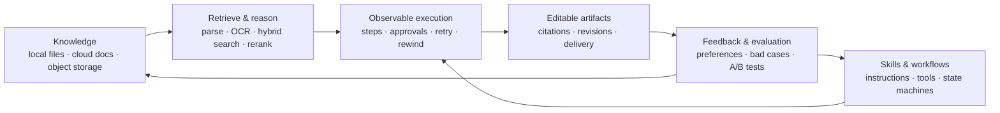

This loop is built from three connected systems:

| System | Responsibility | Product behavior |
|--------|----------------|------------------|
| **Knowledge Foundation** | Give AI the right context | Multi-source ingestion, OCR, hybrid retrieval, reranking, and source traceability |
| **State Brain** | Keep long tasks on course | Visible steps, approvals, editable artifacts, retries, rewinds, and version history |
| **AI Growth Engine** | Improve future runs safely | Reviewable preferences and terminology plus evaluation, diagnosis, A/B tests, and rollback |

## Core highlights

### 1. Deliver outcomes, not chat messages

Choose knowledge and a Skill; LazyMind continues from source organization through planning, generation, review, and delivery. Workflows define steps, tools, inputs, outputs, and transitions as state machines, while artifacts preserve editable results and revision history.

For long-running work, each step remains visible. Users can approve checkpoints, edit an artifact, or rerun from the failed step instead of restarting the whole task.

<table>
  <tr>
    <td width="50%" align="center">
      <a href="docs/assets/artifact-workspace-en.png">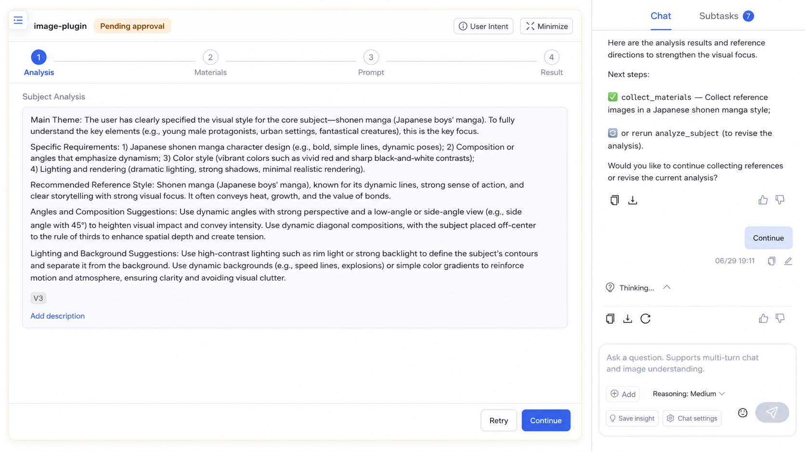</a>
      <br /><sub>Inspect and edit the Artifact before continuing</sub>
    </td>
    <td width="50%" align="center">
      <a href="docs/assets/artifact-version-diff-en.png">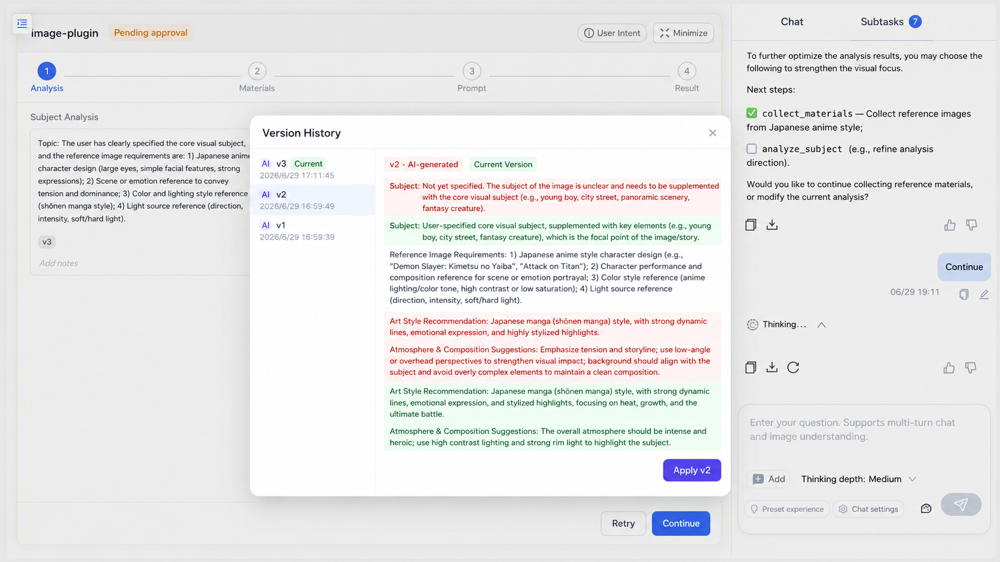</a>
      <br /><sub>Review a version diff and restore the result you need</sub>
    </td>
  </tr>
</table>

### 2. Ground every run in reusable knowledge

Local directories, object storage, Feishu, Notion, and other sources feed a unified knowledge base. PDFReader, MinerU, or PaddleOCR-VL parses documents; multi-embedding retrieval, hybrid search, and reranking keep results grounded in relevant evidence.

<table>
  <tr>
    <td width="50%" align="center">
      <a href="docs/assets/knowledge-library-en.jpg">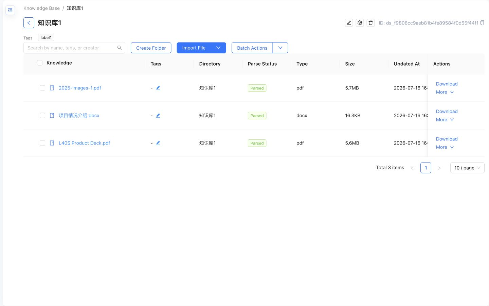</a>
      <br /><sub>Organize documents and track parsing status in one knowledge base</sub>
    </td>
    <td width="50%" align="center">
      <a href="docs/assets/knowledge-cited-answer-en.jpg">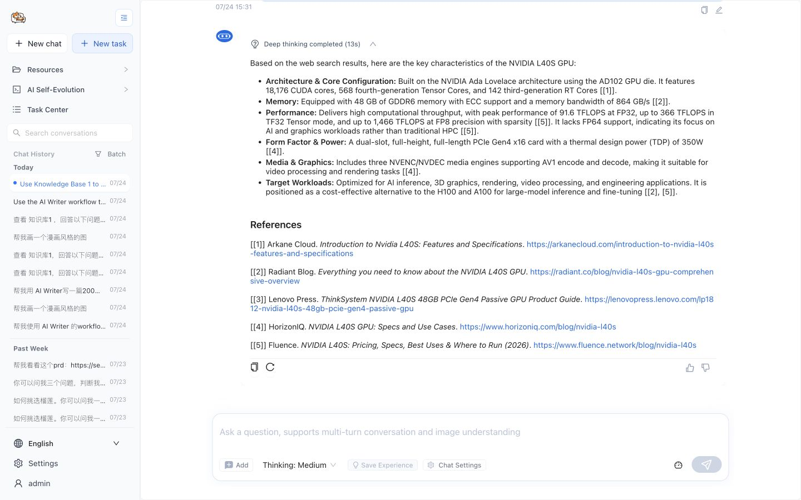</a>
      <br /><sub>Ground answers with inline citations and traceable references</sub>
    </td>
  </tr>
</table>

### 3. Package expert practice into reusable workflows

Research methods, writing processes, and domain standards can be managed as Skills and converted into executable Workflows. Teams can diagnose, repair, publish, version, and roll them back instead of rebuilding the same setup from prompts and scripts. See the [Workflow format specification](docs/workflow-format.md).

<table>
  <tr>
    <td width="50%" align="center">
      <a href="docs/assets/skill-to-workflow-entry-en.png">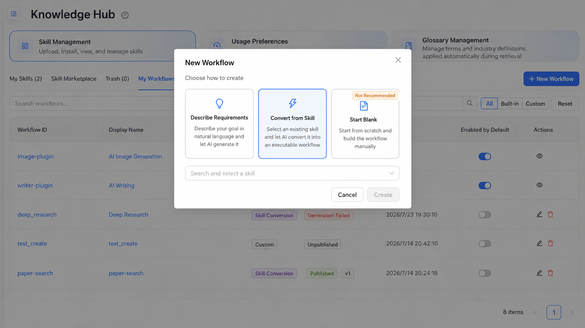</a>
      <br /><sub>Select a Skill as the source of a new workflow</sub>
    </td>
    <td width="50%" align="center">
      <a href="docs/assets/skill-to-workflow-editor-en.png">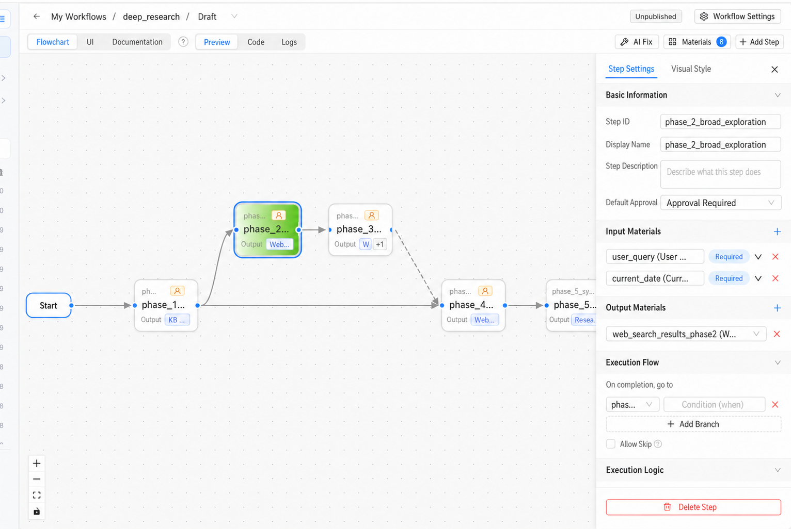</a>
      <br /><sub>Inspect, refine, publish, and version the generated workflow</sub>
    </td>
  </tr>
</table>

### 4. From an idea to an editable presentation

The PPT Workflow carries a presentation request through research, outline approval, slide generation, review, and export. It can use the user's prompt, uploaded files, LazyMind knowledge bases, web search results, and AI-generated images as source material, and it produces speaker notes for each slide.

After generation, users can reorder or remove slides and select text or elements for natural-language content and style changes. Results can be exported as PDF, image-based PPTX, or editable PPTX containing text, shapes, images, and charts.

> **Image placeholder: end-to-end PPT Workflow.** Use one 16:9 screenshot showing the execution stages on the left, a real slide preview in the center, and the outline or source-material panel on the right. The stages should visibly cover research, outline, generation, review, and export.

### 5. Discover ready-to-run scenarios in the Capability Center

The Capability Center brings quick chat, complex tasks, and curated examples into one entry point. Users can filter by scenario, capability type, and technical tags; inspect the description, workflow, example input, and interactive result; then launch the capability in Chat or Work. Curated entries are backed by runnable Skills and installed on demand when first used.

> **Image placeholder: Capability Center home and detail view.** Show category filters, at least six curated capability cards, and one detail view with a real result preview and a visible “Try it” action. The image should make clear that these are runnable capabilities rather than static examples.

### 6. Read, question, and revise directly inside documents

The document preview supports conversations scoped to the current document and can cite PDF selections, knowledge chunks, or partial chunk content. Temporary document conversations stay out of normal chat history unless the user chooses to promote and save them.

Selections in chat answers and Writer documents can be revised by AI at the smallest relevant scope. Users review the diff, accept or reject the result, and follow citations back to the original document.

> **Image placeholder: document chat and local revision pair.** Use two side-by-side screenshots: a PDF selection entering a document-scoped conversation with citations, and an AI revision diff with visible Accept and Reject actions.

### 7. Give external agents the same knowledge and capabilities

LazyMind can discover local projects and native task histories from Codex, Cursor, WorkBuddy, TRAE Work, DeepSeek Harness, and other agents, then create, continue, and inspect their work in one workspace. Through MCP, external agents can also use LazyMind Workflows, Skills, knowledge bases, and cloud documents without rebuilding the same task context.

> **Image placeholder: external-agent collaboration.** Show a Codex or Cursor task discovered and continued inside LazyMind, including project or session selection, execution status, tool steps, and a final artifact. Avoid using only a Settings connection screen.

### 8. Improve only after evidence

Knowledge Ops captures what the user wants—preferences, terminology, experience, and Skills. `evo` tests how the system should improve by turning bad cases into evaluation samples and running baseline evaluation, diagnosis, repair, and A/B testing.

<table>
  <tr>
    <td width="50%" align="center">
      <a href="docs/assets/skill-review-en.jpg">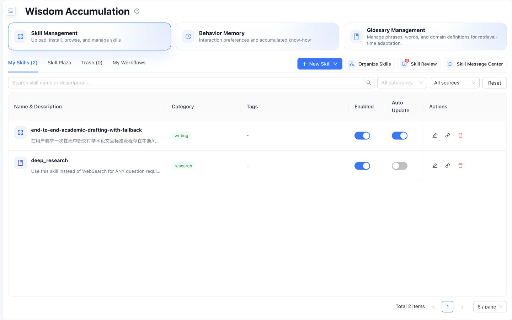</a>
      <br /><sub>Knowledge Ops reviews Skills, preferences, terminology, and experience</sub>
    </td>
    <td width="50%" align="center">
      <a href="docs/assets/evo-pipeline-en.jpg">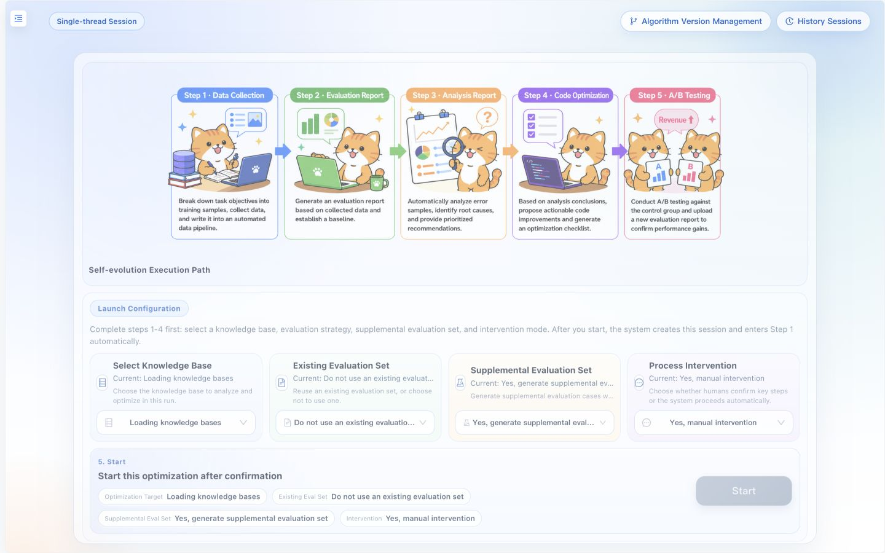</a>
      <br /><sub>Algorithm evolution validates improvements before rollout</sub>
    </td>
  </tr>
</table>

### 9. Start local, scale when collaboration requires it

Desktop Mode uses native processes, SQLite, and Milvus Lite with platform-standard data paths. Shared deployments add Kong, JWT/RBAC, Core ACL, external Milvus/OpenSearch, and on-premises OCR. Your workflow stays recognizable across both modes.

---

## Quick start

### Run locally

Prerequisites: Go, Python 3, uv, pnpm, and Node.js.

```bash
make local-up
```

On native Windows PowerShell:

```powershell
make local-win-up
```

After startup:

- LazyMind: http://localhost:8090
- API docs: http://localhost:8090/docs.html
- Default credentials: `admin` / `admin`

After login, open **Settings** in the frontend:

- Add provider credentials and API keys under **Model Providers**, then select the default LLM, embedding, and reranker under **System Defaults**. Multimodal embedding, VLM, speech, image, video, and evolution models are optional.
- Configure service credentials under **Tools** when needed, including MinerU or PaddleOCR for document parsing, web and academic search engines, and other integrations. No environment variable is required for a hosted MinerU API key.

<table>
  <tr>
    <td width="50%" align="center">
      <a href="docs/assets/settings-models-en.jpg">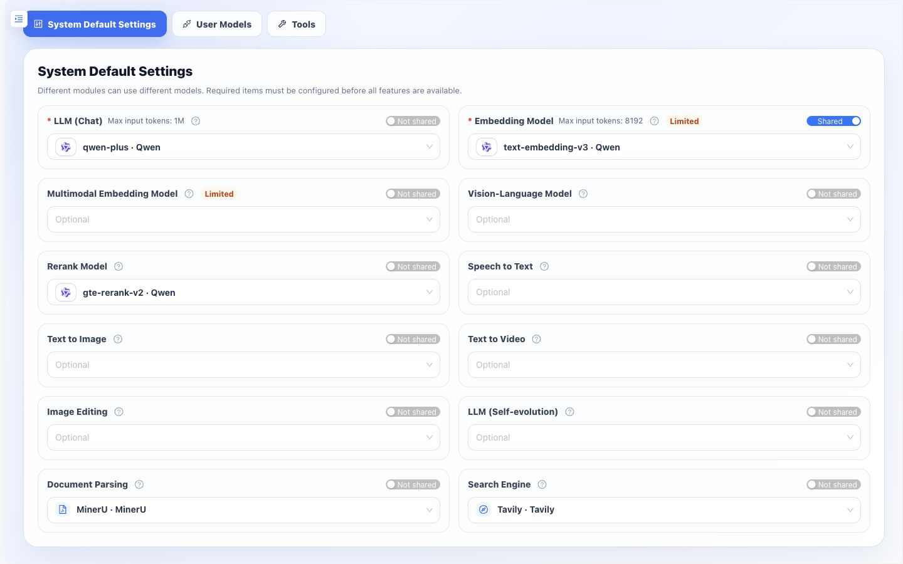</a>
      <br /><sub>Select the default models for each system capability</sub>
    </td>
    <td width="50%" align="center">
      <a href="docs/assets/settings-tools-en.jpg">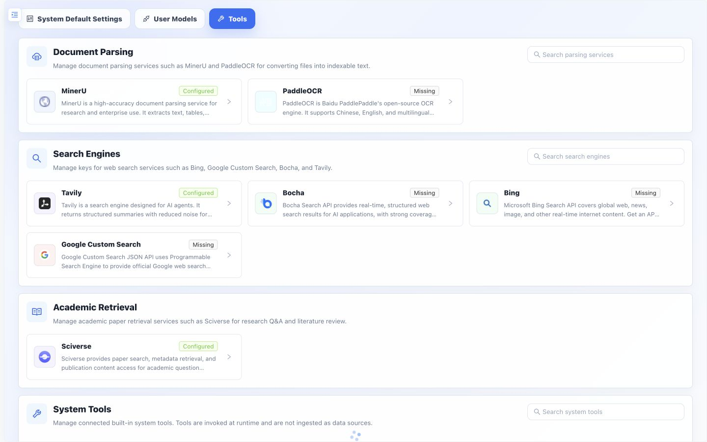</a>
      <br /><sub>Configure document parsing, search, and integration credentials</sub>
    </td>
  </tr>
</table>

Stop the local runtime with:

```bash
make local-down
```

Use `make local-win-down` on Windows. See the [Quick Start guide](docs/quick_start.md) for complete configuration.

### Build the desktop application

| Platform | Command | Output |
|----------|---------|--------|
| macOS arm64 | `make desktop-darwin-arm64` | macOS desktop application |
| Windows x64 | `make desktop-windows-x64` | Portable ZIP |
| Windows x64 | `make desktop-windows-x64-installer` | Installer |

### Deploy with containers

```bash
make up
```

This starts both the Docker services and the host-side Assistant Bridge. Open **Settings → Assistants** to connect Codex, Cursor, WorkBuddy, Raccoon, TRAE Work, or DeepSeek Harness without running separate MCP configuration commands. If Docker is installed but Go is not, the bridge is cross-compiled for the host automatically inside Docker.

On Windows, run this command from Git Bash with `make` available. Do not replace it with bare `docker compose up`: containers cannot inspect or launch programs installed on the Windows host. If an application uses a custom or portable location, **Settings → Assistants** accepts its full Windows path and validates it through the host-side bridge.

### Startup Command Reference

| Scenario | Command |
|----------|---------|
| Build images and start | `make up-build` |
| Deploy MinerU OCR on-premises | `make up LAZYMIND_DEPLOY_MINERU=1` |
| Deploy PaddleOCR on-premises | `make up LAZYMIND_DEPLOY_PADDLEOCR=1` |
| Use external Milvus/OpenSearch | `make up LAZYMIND_MILVUS_URI=http://your-milvus:19530 LAZYMIND_OPENSEARCH_URI=https://your-opensearch:9200` |

See the [Colima setup guide](docs/quick_start.md#macos-use-colima-instead-of-docker-desktop) or the complete [Quick Start guide](docs/quick_start.md). The [Architecture guide](docs/architecture.md) covers service dependencies, environment variables, and the authentication chain.

---

## Available today

| Area | Current capabilities |
|------|----------------------|
| Knowledge base | Multiple sources, OCR, vectorization, hybrid retrieval, reranking, sync management |
| Agents | RAG chat, tool calls, subtask timeline, artifacts, task center, long-context compression |
| Content creation | AI Writer, PPT Workflow, AI Image, local revision, multi-format export |
| Workflows | State machines, dynamic routing, automatic review, retry/rewind, visual execution, versioned artifacts |
| Skills | Installation, organization, review, revisions, rollback, Skill → Workflow |
| Capability Center | Curated Skills, scenario categories, interactive demos, on-demand installation |
| Document reading | Current-document chat, PDF selection citations, source navigation, temporary conversations |
| External agents | Local project and session discovery, task continuation, MCP access to knowledge and capabilities |
| Tasks and conversations | Terminal states, archives, recycle bin, recovery, synchronized task and conversation status |
| Self-evolution | Eval-set generation, evaluation, bad-case analysis, repair, deployment, A/B testing |
| Local experience | macOS/Windows local runtime, desktop builds, platform-standard data paths |
| Enterprise | Kong, JWT/RBAC, ACL, OAuth sources, optional external storage |

This table describes capabilities implemented in the repository today, not a future roadmap. See [docs](docs/) for module design and implementation details.

---

## Roadmap

LazyMind's next phase is not about adding more isolated features. The goal is to strengthen the Skill Runtime so knowledge, Skills, Workflows, and self-evolution form complete task loops both inside LazyMind and across other agents.

### Near term: complete the core v0.4 capabilities

**Skill Runtime and Desktop**

- **Popular Skill compatibility and evaluation**: measure installability, safety, core-flow completion, and output quality so verified Skills run without source changes and failures explain the actual cause.
- **Curated Skill scale-up**: expand verified official Skills and reproducible demos across representative industries and tasks, using quality results as a recommendation signal.
- **Skill → Workflow experience**: add preflight checks, progress and failure diagnosis, task recovery, and explicit association with the original Skill; let users choose either execution path.
- **On-demand Skill and Tool retrieval**: retrieve only the capabilities relevant to a task and load full definitions after a match to reduce context and token use.
- **Trusted local workspace**: let Desktop Work users select and authorize local folders, read or write within explicit boundaries, and review or revoke access.
- **Browser context**: use a Chrome extension, with user authorization, to obtain the current page title, body, links, and basic metadata for complex tasks.
- **Onboarding and task preflight**: improve model setup, dependency checks, permission guidance, failure recovery, and local-runtime diagnostics for non-developers.

**External agent ecosystem**

- **Complete Workflow invocation**: let Codex, Cursor, WorkBuddy, TRAE Work, DeepSeek Harness, and other supported agents submit Skills and tasks, then receive status, result files, and LazyMind task links.
- **Unified document access**: expose local files, Feishu, Notion, and Google Drive within existing authorization boundaries and return consistent content and source metadata.
- **Shared models and tools**: proxy authorized models and tools through LazyMind so multiple agents can reuse one configuration without receiving raw API keys.
- **Permissions and audit**: centrally manage external-agent grants, call status, usage, and execution history.

**Task and resource infrastructure**

- **Unified File Resource**: cover attachments, knowledge bases, web results, MCP Resources, and every Artifact type, with on-demand reading for large content.
- **Conversation organization**: support conversation forks, groups, and retained sub-conversations so exploratory branches remain organized and resumable.
- **Artifact delivery**: give documents, sheets, images, code, and archives explicit completion, preview, and download states.
- **Preference consolidation**: merge duplicate or conflicting preferences and remove low-value entries so important preferences continue to reach task context.

### Mid term: connect knowledge, creation, and distribution

**Knowledge sources, editing, and publishing**

- **Long-form sources**: connect Obsidian, GitHub Docs/Wiki, and Yuque while improving Notion synchronization, attachments, and write-back.
- **Unified content representation**: strengthen round-trip conversion among Markdown, Writer IR, and platform rich text, previewing format degradation without silently dropping images, code, or body content.
- **Result delivery**: improve high-fidelity DOCX and other exports, shareable result pages, and publishing to Feishu, Notion, and WeChat Official Account drafts.
- **Multi-channel notification and email**: deliver scheduled-task results through Feishu, WeCom, WeChat, and other channels; support email reading, task assistance, and draft generation.
- **Scenario packages and team governance**: package Workflows, Skills, knowledge, review rules, and output formats together, with dependency, security, version, and organization controls.

**Flagship scenario: evidence-driven paper research and technical writing**

- Translate, explain, question, collect vocabulary, and save evidence from PDF selections, with navigation back to the original text.
- Expand from one paper to related-paper search, import, multi-paper comparison, and literature review while distinguishing full text, abstracts, and model inference.
- Introduce Evidence between papers and the final document, bind evidence to sections, draft incrementally, and check whether key claims are supported.
- Reuse AI Writer for material analysis, outlining, section drafting, local evidence repair, citation verification, and export with a complete paper list.

> **Image placeholder: paper reading to technical-guide workflow.** Use a horizontal flow or four-panel composition showing PDF selection reading, the paper Evidence list, multi-paper comparison, and citation-grounded writing in AI Writer. Every stage should visibly preserve source information or navigation back to the original text.

### Long term: from executable workflows to a self-evolving work system

- Detect workflow and knowledge gaps from user edits, reruns, citations, and final acceptance signals.
- Continuously evaluate and A/B test retrieval strategies, prompts, models, tools, and Workflow revisions.
- Turn successful execution patterns into reusable Skills, templates, and organizational memory with full provenance and version history.
- Expand across industries through horizontal task templates, vertical knowledge packs, and installable scenario packages instead of rebuilding the product for every industry.

The roadmap will evolve based on real workflow completion rates, output quality, human interventions, latency, and cost. Repository issues, milestones, and release notes remain the source of truth for specific releases.

---

## Project layout

```text
LazyMind/
├── frontend/                   # Web UI and desktop frontend
├── backend/
│   ├── auth-service/           # Authentication, OAuth, and users
│   ├── core/                   # Data, tasks, retrieval, Workflows, and ACL
│   └── scan-control-plane/     # Source scanning and synchronization
├── algorithm/
│   └── lazymind/               # Chat, parsing, retrieval, and agent runtime
├── workflows/                    # Built-in Workflows
├── skills/                     # Built-in and curated Skills
├── evo/                        # Self-evolution and evaluation loop
├── desktop/                    # Electron desktop application and packaging
├── local/                      # Host-local runtime management
├── api/                        # OpenAPI specifications
├── docs/                       # Architecture, usage, and design docs
└── tests/                      # Cross-service tests
```

---

## Development and testing

```bash
make lint              # Python, Go, docs, and other static checks
make lint-only-diff    # Check changed files only
make test              # Test with host-provided runtimes
make test-hermetic     # Test the same scope in project-managed runtimes
```

- Python 3.11+
- Go 1.24.0
- Node.js 20
- OpenAPI specifications are maintained under `api/`

---

## License

See [LICENSE](LICENSE).
